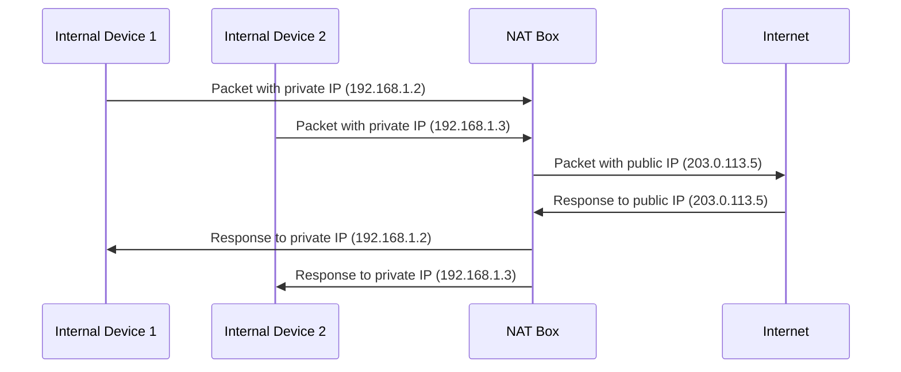

# NAT boxes as a kludge solution to IPV4 life
Since before 2000 there was an insufficiency in the number of IP addresses, an ISP could have an address of /16 (65,535 host numbers) and the migration to IPv6 did not arrive. To avoid running out of addresses, the Network Address Translation protocol is born, which is described in RFC 3022.   
NAT was built into access point (AP) devices, it makes use of transport layer fields by assuming udp/tcp, source and destination ports resolve to other addresses on the subnet and by using boxes NAT replaces ports and redirects packets.
NAT did solve the problem of missing addresses, but it was not the most appropriate since it delayed the transition to IPv6. The implementation was heavily criticized because it violates the IP model, it changes the orientation of a network (from connectionless to connection-oriented), it violates TCP/IP principles by making one layer assume another, and there are more negative points.

## Illustrative Diagram
This diagram illustrates how NAT boxes are used to extend the life of IPv4 by allowing multiple devices on an internal network to share a single public IP address. The NAT box translates the private IP addresses of the internal devices to the public IP address for communication with the internet, and vice versa.  

## Study Resources

### Bibliography

- **"Computer Networks" by Andrew S. Tanenbaum and David J. Wetherall**: A comprehensive guide to networking concepts, protocols, and architectures.
- **"Distributed Systems: Principles and Paradigms" by Andrew S. Tanenbaum and Maarten Van Steen**: An essential read for understanding the principles and design of distributed systems.
- **"TCP/IP Illustrated, Volume 1: The Protocols" by W. Richard Stevens**: A detailed exploration of the TCP/IP protocol suite.

### Papers
- **"End-to-End Arguments in System Design" by J.H. Saltzer, D.P. Reed, and D.D. Clark**: A seminal paper discussing the end-to-end principle in network design.
- **"The Byzantine Generals Problem" by Leslie Lamport, Robert Shostak, and Marshall Pease**: A fundamental paper on fault tolerance in distributed systems.

### Websites and Blogs
- **IETF (Internet Engineering Task Force)**: For the latest RFCs and networking standards.
- **ACM Queue**: For articles and insights on distributed systems and networking.
